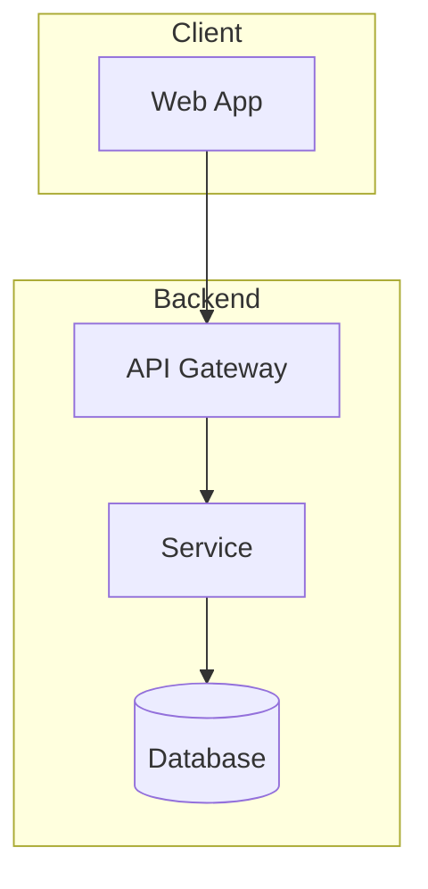
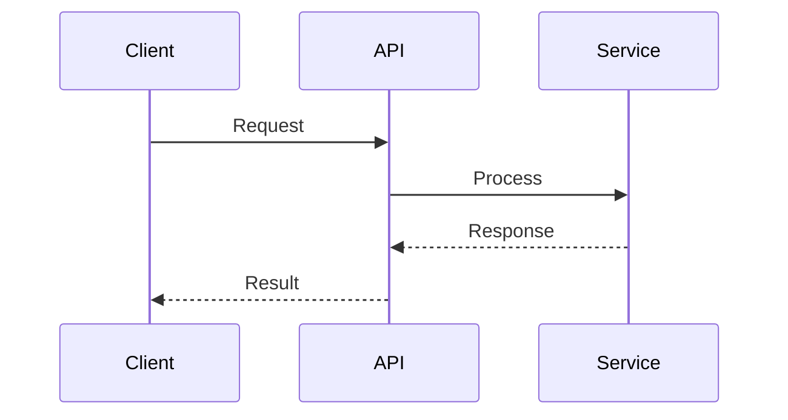

# Writing Technical Design Documents

Output format: **Markdown with Mermaid diagrams**. Follow ECAR structure.

## ECAR Structure

| Section | Purpose | Length |
|---------|---------|--------|
| **E**xecutive Summary | What and why (high-level) | 1-2 paragraphs |
| **C**ontext | Current state, constraints, drivers | 2-4 paragraphs |
| **A**pproach | Technical design, diagrams, specs | Main body |
| **R**esolution | Plan, risks, alternatives, next steps | 2-4 sections |

## Document Header (Always Include)

```markdown
# Technical Design: [Title]

| Field | Value |
|-------|-------|
| Status | Draft / Under Review / Approved / Implemented |
| Author | [Name] |
| Reviewers | [Names] |
| Last Updated | [Date] |
| Related Tickets | [Links] |
```

## Section Guidelines

### Executive Summary
- Problem statement in 1-2 sentences
- Proposed solution in 1-2 sentences
- Key stakeholders

### Context
- Current state / existing system
- Pain points driving this design
- Constraints (timeline, budget, compliance)
- Dependencies on other systems

### Approach
Required subsections:
- **High-Level Architecture** (include Mermaid diagram)
- **Component Details** (table format)
- **Data Flow** (include Mermaid sequence diagram if applicable)
- **API Specifications** (if applicable)
- **Security Considerations**

### Resolution
Required subsections:
- **Implementation Phases** (numbered list with milestones)
- **Risks & Mitigations** (table format)
- **Alternatives Considered** (why rejected)
- **Success Criteria** (measurable metrics)

## Mermaid Diagrams

### Architecture Diagram
```markdown

```

### Sequence Diagram
```markdown

```

### Component Table Format
```markdown
| Component | Responsibility | Technology |
|-----------|----------------|------------|
| API Gateway | Request routing, auth | Kong |
| Service | Business logic | Python/FastAPI |
| Database | Data persistence | PostgreSQL |
```

### Risk Table Format
```markdown
| Risk | Impact | Likelihood | Mitigation |
|------|--------|------------|------------|
| [Risk description] | High/Med/Low | High/Med/Low | [Strategy] |
```

## Anti-Patterns

❌ Abstract descriptions without concrete details  
❌ Missing diagrams in Approach section  
❌ No alternatives considered  
❌ Unquantified success criteria  
❌ Missing risk assessment

## Checklist Before Completion

- [ ] Header metadata filled in
- [ ] At least one Mermaid architecture diagram
- [ ] Component table with technologies specified
- [ ] Risk table with mitigations
- [ ] Alternatives section explains trade-offs
- [ ] Success criteria are measurable
